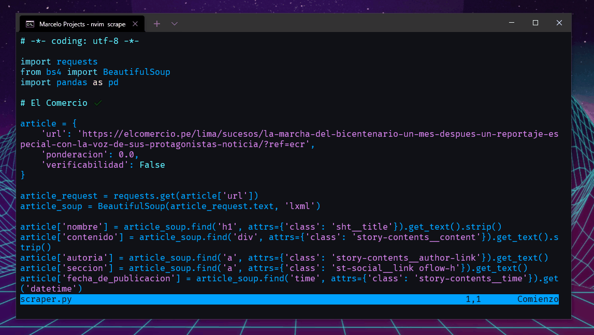

<h1 align="center">🕷️ DSRP Webscraping Algorithms 💻</h1> 

    Repository with the current webscraping progress in DSRP project

    Repositorio con el actual progreso de webscraping en el proyecto DSRP

    
    

    
    

## 🔨 Builded with
### Requests
`Requests` allows you to send **HTTP/1.1** requests extremely easily. There’s no need to manually add query strings to your URLs, or to form-encode your POST data. Keep-alive and HTTP connection pooling are 100% automatic, thanks to [urllib3](https://github.com/urllib3/urllib3).

### Beautiful Soup
`Beautiful Soup` is a Python package for parsing HTML and XML documents (including having malformed markup, i.e. non-closed tags, so named after tag soup). It creates a parse tree for parsed pages that can be used to extract data from HTML, which is useful for web scraping.

### Pandas
`Pandas` is a software library written for the Python programming language for data manipulation and analysis. In particular, it offers data structures and operations for manipulating numerical tables and time series.

## 📃 License
Distributed under the MIT License.
See [`LICENSE`](./LICENSE) for more information.

